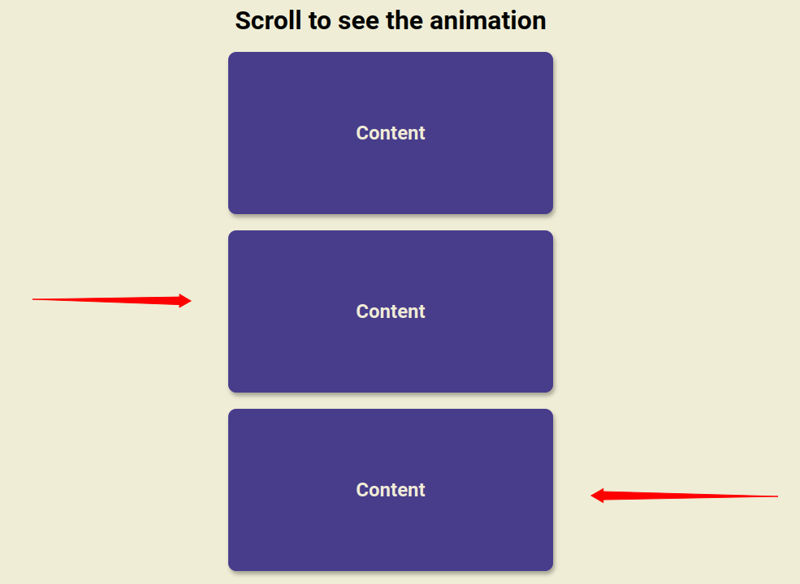

# Scroll Animation

I used this to learn how to have animations triggered by scrolling and making use of a method that provides information about the size of an element and its position relative to the viewport.

```
Element.getBoundingClientRect()
```


